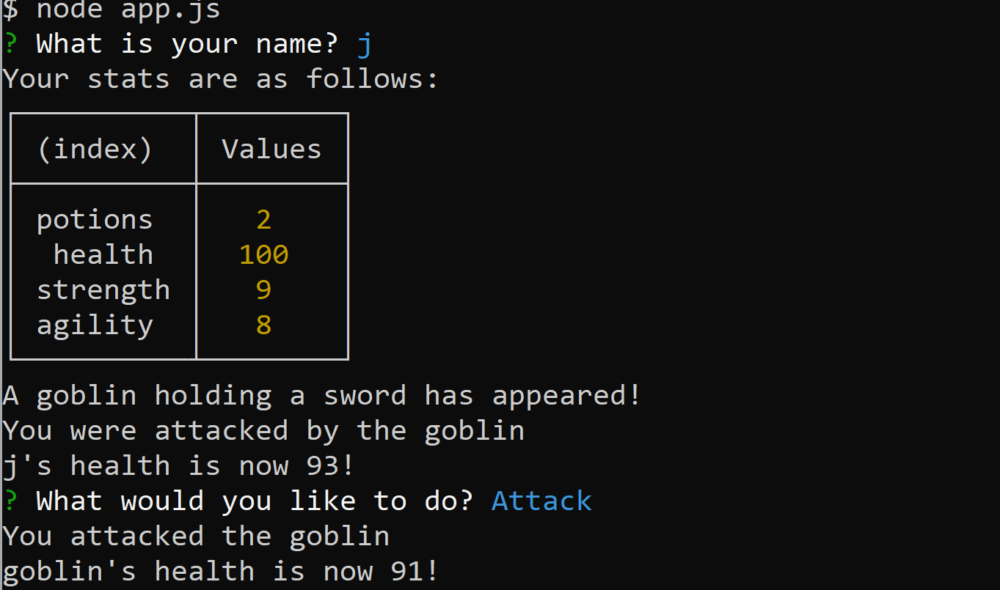

  # Jest Another RPG
  This project is not licensed

  ## Table of Contents:

  ---
  * [Description](#description)
  * [Installation](#installation)  
  * [Usage](#usage)  
  * [Credits](#credits)    
  * [Tests](#tests)  
  * [Questions](#questions)  

  ## Description

  ---
  This project is an RPG built using object oriented programming, node.js and jest to test constructor functions. The constructor functions were later refactored into ES6 formatting.

  ## Installation:

  ---
  To install all necessary dependencies for this program,
  open the console and run the following command:  
  ```npm i```

  ## Usage

  ---
  The usage of this project is a simple text based console game to explore the possibilities of object oriented programming and constructor functions
  

  ## Credits

  ---
  There are no additional people who have contributed to this project.

  ### Third Party Assets:
  node.js, inquirer, jest
  
  ### Third Party Docs / Contribution:
  Trilogy Education 

  ## Tests

  ---
  To test this application run this command in the console:  
  ```node app.js```

  ## Questions

  ---
  For any questions feel free to reach out through the following contacts:  

  Email: jacob.tobin.liberty@gmail.com  
  Github: https://github.com/JacobGit3  
  